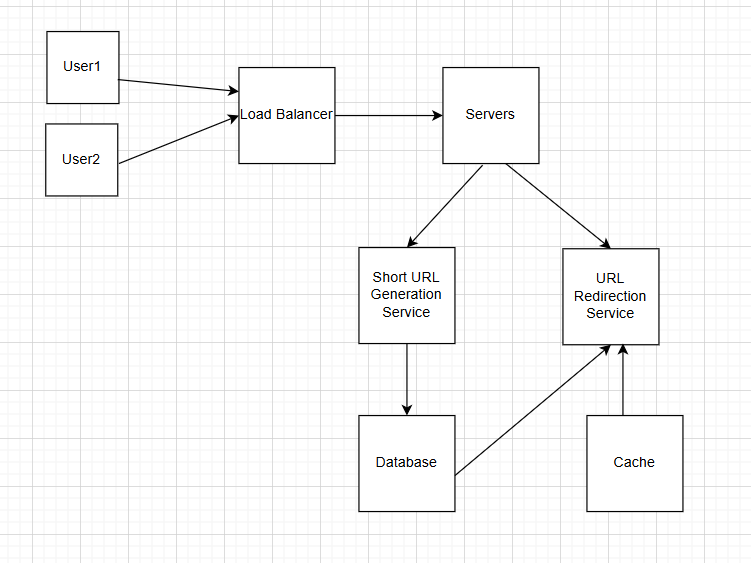

# URL Shortener
A backend URL shortener service that generates unique short links, handles redirection, and tracks basic analytics, built with a focus on clean architecture and scalability.

# Problem Statement
Design and implement a scalable, highly available URL shortening service that converts long URLs into short, unique links and efficiently redirects users while handling high read traffic, failures, and abuse.

# Functional Requirements
- System should be able to generate unique short url generation from long url
- System should be able to redirect to long url on short url given

# Non Functional Requirements
- System should be highly available.
- System should be horizontally scalable (adding more servers) at the peak time. 
- System should performed at low latency(less time between request and server response).
- The short urls generated by the system should be highly unpredictable.

# Resource Estimation
Assumptions
- 50 million daily active user
- User send 5 url shortening request per day on average
- Read to write ratio is 100:1 (for each write, there will be 100 read request)
- Url shortening requires 500 bytes of database storage
- 3 years of expiry time.

QPS(Query per Second)
- Average writes per sec = 50 million * 5 / (24 * 60 * 60) = 250 million / 86400 = 2,893 writes/sec
- Average reads per sec = 250 million * 100 / (24 * 60 * 60) ~ ≈ 289,351 reads/sec

Peak QPS
- Assume 5X would be the peak
- Peak Write QPS  = 2,893 × 5 ≈ 14,500 writes/sec
- Peak Read QPS = 289,351 × 5 ≈ 1.45 million reads/sec

Storage
- Total writes for 3 years = 250 M * 365 * 3  = 273.75 billion URLs 
- Total Storage = 273.75 billion URLs * 500 bytes ≈ 136.9 TB

Cache
- Let's assume caching 0.1% hot URLs
- hot URLs = 273.75B × 0.1% = 273M URLs
- Cache Size = 273M * 500 bytes ≈ 109 GB
- Final Redis cache : 120-150 GB

# High-level architecture diagram

# API design
# Scalability & trade-offs
# Failure handling
# Future improvements